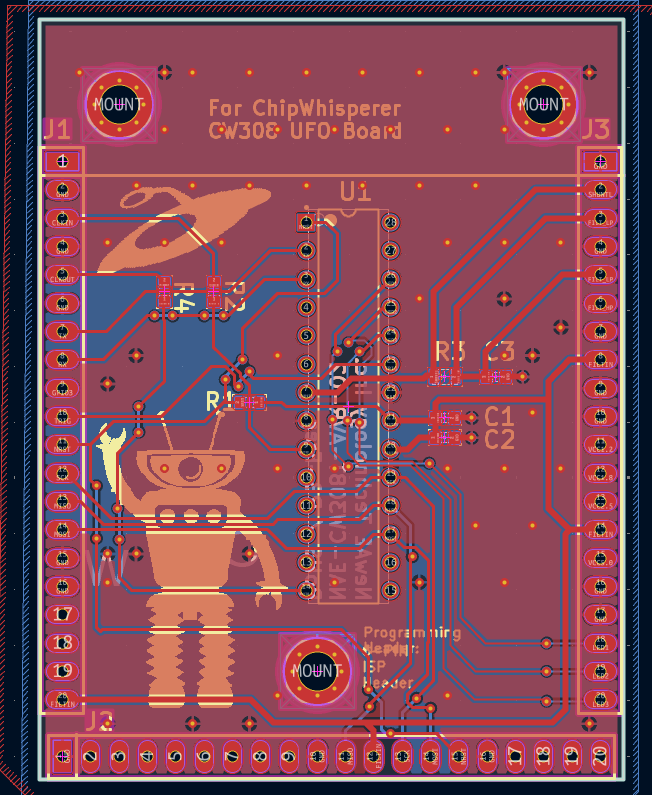
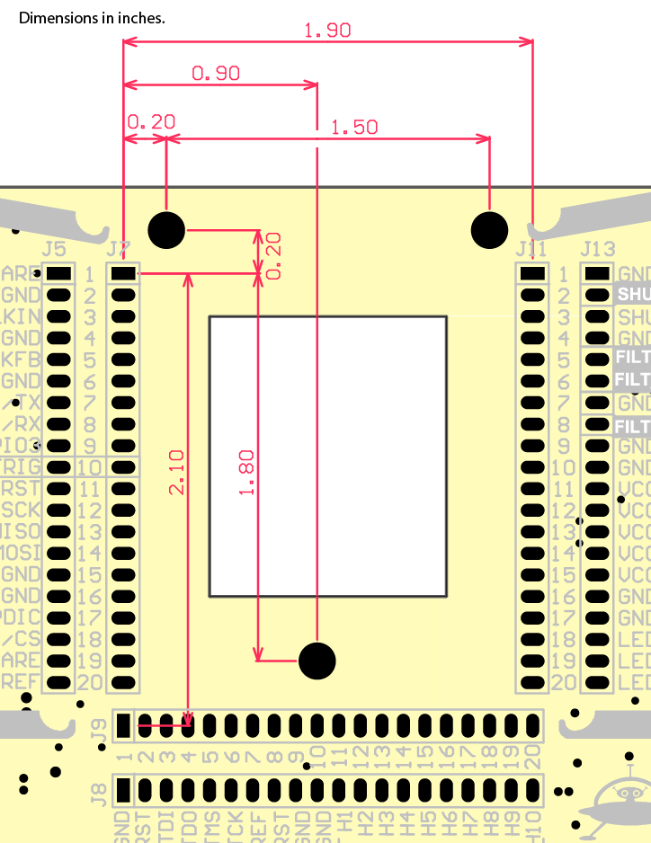

# CW308_UFO_target_template_Dreg_Port

chipwhisper UFO CW308 TARGET template for KiCad with Dreg port (and easyeda file to import)

-----

# PCB

- ENIG
- PCB Size: 52.3mm x 64.6mm
- 2 layers
- male pins 

UFO BOARD SOCKET FEMALE:

-----

# MALE PINS

- 800-10-020-10-001101
- Preci-dip
- https://www.mouser.es/ProductDetail/437-8001002010001101

-----

# FEMALE PINS
- 801-87-020-10-001101
- Preci-dip
- https://www.mouser.es/ProductDetail/437-8018702010001101

------

# kicad project 

[CW308T_AVR_Kicad_Dreg_Port.zip](CW308T_AVR_Kicad_Dreg_Port.zip)

------

# easyeda pro file to import

[ProPrj_CW308T_AVR_Kicad_Dreg_Port_2026-06-29.epro2](ProPrj_CW308T_AVR_Kicad_Dreg_Port_2026-06-29.epro2)
